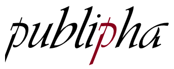

---
output:
  github_document:
    html_preview: true
---

<!-- README.md is generated from README.Rmd. Please edit that file -->

```{r, echo = FALSE}
knitr::opts_chunk$set(
  collapse = TRUE,
  comment = "#>",
  fig.path = "man/figures/README-"
)
```

```{r setup_samples, include = FALSE, cache = TRUE}
library("publipha")
set.seed(313)
model_psma = publipha::psma(yi = yi,
                            vi = vi,
                            alpha = c(0, 0.025, 0.05, 1),
                            data = metafor::dat.bangertdrowns2004)

set.seed(313)
model_cma = publipha::cma(yi = yi,
                          vi = vi,
                          alpha = c(0, 0.025, 0.05, 1),
                          data = metafor::dat.bangertdrowns2004)

```


# publipha 

[](https://travis-ci.com/JonasMoss/publipha)
[](https://cran.r-project.org/package=publipha)
[](https://codecov.io/gh/JonasMoss/publipha?branch=master)
[](https://www.repostatus.org/#wip)

An `R` package for Bayesian meta-analysis that accounts for publication bias or *p*-hacking.
```{r setup, include=FALSE}
library("publipha")
knitr::opts_chunk$set(echo = TRUE)
knitr::opts_chunk$set(out.width='750px', dpi=200)
```

## Overview
publipha is an package for doing Bayesian meta-analysis that accounts for 
publication bias or *p*-hacking. Its main functions are:

* `psma` does random effects meta-analysis under publication bias with a 
   one-sided *p*-value based *selection probability*. The model is roughly the 
   same as that of [(Hedges, 1992)]((https://www.jstor.org/stable/pdf/2246311.pdf))
*  `phma` does random effects meta-analysis under a certain model of *p*-hacking
   with a one-sided *p*-value based propensity to *p*-hack. This is based
   on the forthcoming paper by Moss and De Bin (2019).
*  `cma` does classical random effects meta-analysis with the same priors
   as `psma` and `cma`.

## Installation
Use the following command from inside `R`:
```{r install, echo = TRUE, eval = FALSE}
# install.packages("devtools")
devtools::install_github("JonasMoss/publipha")
```

## Example Usage
Call the `library` function and use it like a bare-bones `metafor::rma`. The 
`alpha` tells `psma` or `phma` where they should place the cutoffs for significance.

```{r simpleuse, echo = TRUE, eval = FALSE}
library("publipha")
# p-hacking model
set.seed(313) 
model = publipha::phma(yi = yi,
                       vi = vi,
                       alpha = c(0, 0.025, 0.05, 1),
                       data = metafor::dat.bangertdrowns2004)

```

## Documentation
Start with the introduction vignette and the companion paper (Moss, De Bin, 2019).

## References
* [Hedges, Larry V. "Modeling publication selection effects in meta-analysis." Statistical Science (1992): 246-255.](https://www.jstor.org/stable/pdf/2246311.pdf)
* Moss, Jonas and De Bin, Riccardo. "Modelling publication bias and p-hacking" Forthcoming (2019)

## How to Contribute or Get Help
If you encounter a bug, have a feature request or need some help, open a [Github issue](https://github.com/JonasMoss/publipha/issues). Create a pull requests
to contribute. This project follows a [Contributor Code of Conduct](https://www.contributor-covenant.org/version/1/4/code-of-conduct.md).
