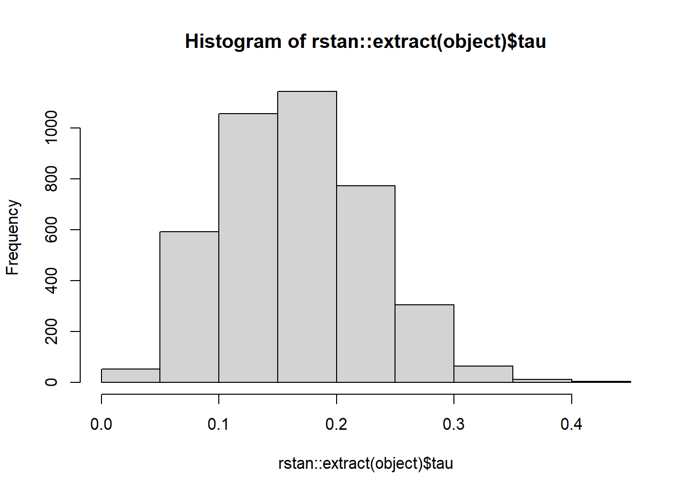

<!-- README.md is generated from README.Rmd. Please edit that file -->

# publipha 

An `R` package for Bayesian meta-analysis that accounts for publication
bias or *p*-hacking.

## Overview

publipha is an package for doing Bayesian meta-analysis that accounts
for publication bias or *p*-hacking. Its main functions are `psma` for
publication bias meta-analyisis and `phma` for *p*-hacking
meta-analysis. These functions have approximately the same syntax as
`rma` from the package
[`metafor`](https://cran.r-project.org/package=metafor). Its
functionality is:

  - `psma` does random effects meta-analysis under publication bias with
    a one-sided *p*-value based *selection probability*. The model is
    roughly the same as in Hedges (1992).
  - `phma` does random effects meta-analysis under a certain model of
    *p*-hacking with a one-sided *p*-value based *propensity to*
    p*-hack*.
  - `cma` does classical random effects meta-analysis with the same
    priors as `psma` and `cma`.

The objects returned from the -`ma` functions are `stan` objects, and
can be handled by the functions from the
[`rstan`](https://cran.r-project.org/web/packages/rstan) package, but
`publipha` offers some convenience functions to handle them with too.

## Installation

From inside `R`, use the following command:

``` r
# install.packages("devtools")
devtools::install_github("JonasMoss/publipha")
```

Call the `library` function and use it like a barebones `metafor::rma`.
The `alpha` tells `psma` or `phma` where they should place the cutoffs
for significance.

``` r
library("publipha")
# Publication bias model
set.seed(313) # For reproducibility
model_psma = publipha::psma(yi = yi,
                            vi = vi,
                            alpha = c(0, 0.025, 0.05, 1),
                            data = metafor::dat.bangertdrowns2004)

# Classical model
set.seed(313)
model_cma = publipha::cma(yi = yi,
                          vi = vi,
                          alpha = c(0, 0.025, 0.05, 1),
                          data = metafor::dat.bangertdrowns2004)
```

You can calculate the posterior means of the meta-analytic mean with
`extract_theta0`:

``` r
extract_theta0(model_psma)
#> [1] 0.1241181
```

``` r
extract_theta0(model_cma)
#> [1] 0.2206233
```

If you wish to plot a histogram of the posterior distribution of `tau`,
the standard deviation of the effect size distribution, you can do it
like this:

``` r
extract_tau(model_psma, hist)
```



## References

  - [Hedges, Larry V. “Modeling publication selection effects in
    meta-analysis.” Statistical Science (1992):
    246-255.](https://www.jstor.org/stable/pdf/2246311.pdf)
